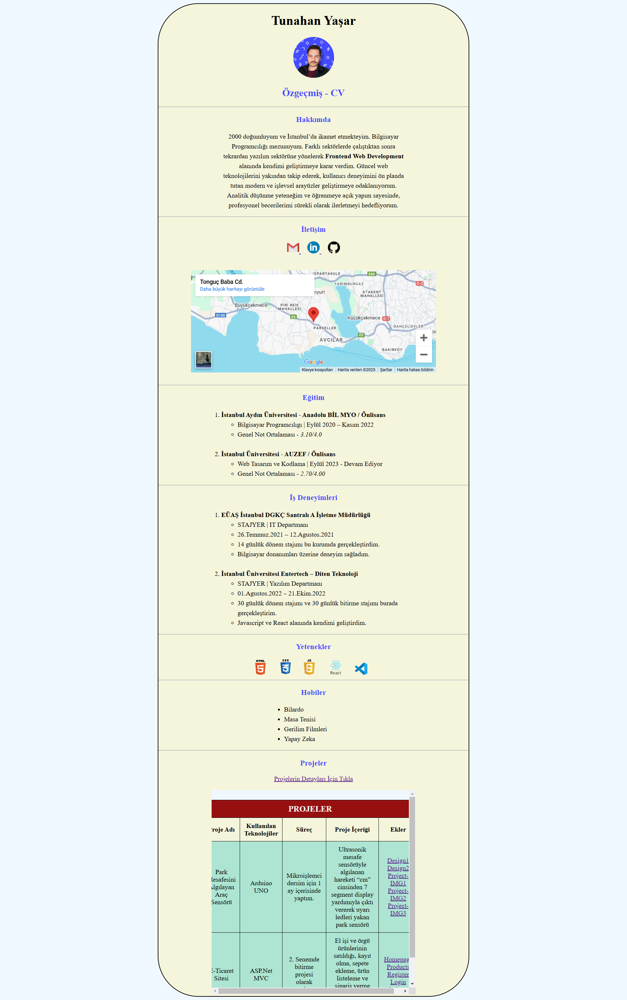

# Kişisel Web Sayfası

## Proje İçeriği;
1. Adımı ve fotoğrafımı sayfanın en üstüne ekledim.
2. Hakkımda kısmını **paragraf** etiketi içerisine doldurdum.
    1. Önemli yerleri **b** etiketi ile belirttim.
3. İletişim kısmında **a** etiketi ile ***mail,linkedin,github*** hesaplarımı yönlendirme yaparak ekledim.
    1. Görsel açıdan düzgün gözükmesi için hesapların logolarını **img** etiketi olarak ekledim.
    2. **Iframe** etiketi ile yaşadığım konumu google haritalardan çekerek sayfama ekledim.
4. Eğitim kısmını ve İş Deneyimleri kısmını iç içe **ul** ve **ol** etiketilerini kullanarak ekledim.
5. Yeteneklerimi text olarak yazmak yerine edindiğim becerileri **img** ile görsel olarak ekledim.
6. Hobileri **ul** ile ekledim.
7. Projelerimi **a** etiketi ile yönlendirme ekleyerek ***projects.html*** içerisinde görüntüledim.
    1. Projeleri **Iframe** özelliği ile önbilgi vermesi açısından sayfama ekledim.
    2. ***projects.html*** içerisinde projelerimi tablo içersine yazarak **CSS** ile hizalama yaptım.
        1. Tablonun içerisine projeler hakkında **a etiketi** ile yönlendirmeli ek görseller ekledim.
8. Son olarak projenin hizalı ve canlı gözükmesi için **head** etiketi altında **style** etiketinde özellikler yazdım.
    1. Küçük eklemeleri etiketlerin kendi içersinde **style** niteliği ile ekledim.

## Sayfanın Çıktısı

