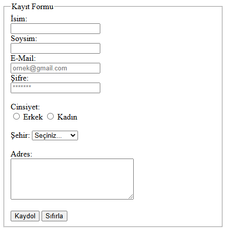
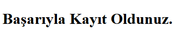

# Pratik - Form Elemanları Kullanımı

## Form Elemanları Kullanarak Form Oluşturulması

1. **form** etiketi açılarak ***action*** niteliği kullanıldı.
2. **form** elemanları **fieldset** etiketi içerisine yazılarak **form**un sınırları belirlendi.
    1. **legend** etiketi ile **fieldset**e başlık atıldı.
3. Kullanıcının ismini ve soyismini yazabileceği **input:text** ve **label** etiketi kullanıldı.
    1. ***required*** niteliği kullanarak bu alan zorunlu kılındı.
4. Kullanıcının e-posta bilgisi **input:email** ve **label** kullanarak istendi.
    1. ***required*** niteliği kullanarak bu alan zorunlu kılındı.
    2. ***placholder*** niteliği ile alantutucu özelliği kullanıldı.
5. Kullanıcıdan **input:password** ve **label** ile **şifre** belirlenmesi istendi.
    1. ***required*** niteliği kullanarak bu alan zorunlu kılındı.
    2. ***placholder*** niteliği ile alantutucu özelliği kullanıldı.
    3. ***minlength*** niteliği ile minimum şifre sınırı belirlendi.
6. **label** ve **input:radio** etiketleri ile kullanıcıya cinsiyet seçimi sunuldu. 
7. **select**, **option** ile kullanıcıdan şehir seçilmesi istendi.
    1. Şehirler **optgroup** etiketi ile bölgelere ayrılarak seçime sunuldu.
8. Adres yazılabilmesi için **textarea** ve **label** etiketleri kullanıldı.
    1. ***rows*** ve ***cols*** nitelikleri ile **textarea** etiketi genişletildi.
9. ***button:submit*** ile form gönderimi ve ***button:reset*** ile form resetlenmesi eklendi.

## Form Çıktısı:

## Submit Çıktısı:
