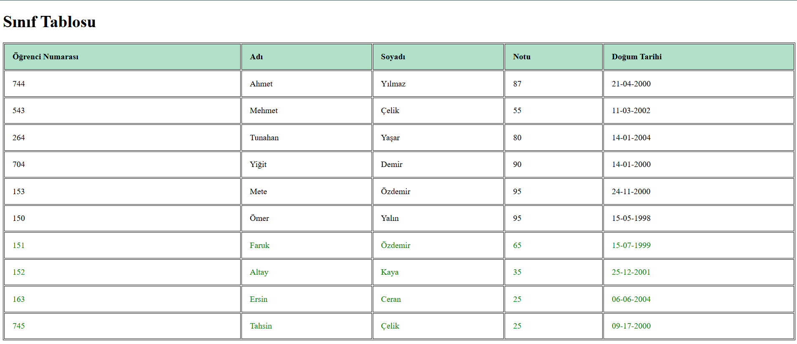

# Pratik - Tablolarla Çalışmak

## Sınıf Tablosu Ödevi

1. **sinif_tablosu.html** dosyası oluşturuldu.
2. **html, head, body, title, style** etiketleri kullanıldı.
3. Sayfa başlığına (title) ve h1 etiketine **"Sınıf Tablosu"** yazıldı.
4. Tüm **table** elementleri düzgün bir şekilde yereleştirildi ve dolduruldu.
5. En az 5 öğrenci eklendi ve bilgileri dolduruldu.
6. Tablonun **css** özellikleri **head** kısmında **style** etiketinin içinde belirtilerek sağlandı.
7. Yeni **tr ve td** etiketi oluşturularak yeni öğrenciler eklendi.
    1. Yeni eklenen öğrencilere **yeşil** renk verildi.
8. Yeni **tr ve th** etiketi oluşturularak doğum tarihi başlığı eklendi.

    

## Tablonun Çıktısı;
